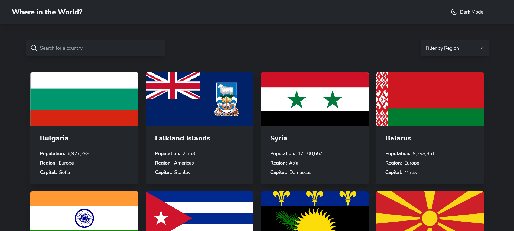
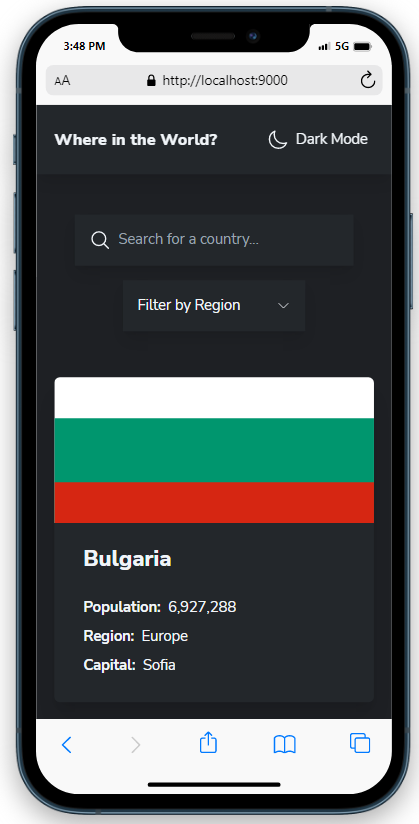

# Frontend Mentor - REST Countries API with colour theme switcher solution

The Rest Countries API Website is a web application that allows users to search for and retrieve information about different countries using the Rest Countries API. The website has a mobile-first design and uses semantic HTML5 markup to ensure that it is accessible to all users. The website is built using Typescript and Tailwind CSS, a popular utility-first CSS framework that allows for quick and easy styling of the website.

## Table of contents

- [Overview](#overview)
  - [The challenge](#the-challenge)
  - [Screenshot](#screenshot)
  - [Links](#links)
- [My process](#my-process)
  - [Built with](#built-with)
- [Author](#author)

## Overview

### The challenge

Users should be able to:

- See all countries from the API on the homepage
- Search for a country using an `input` field
- Filter countries by region
- Click on a country to see more detailed information on a separate page
- Click through to the border countries on the detail page
- Toggle the color scheme between light and dark mode _(optional)_

### Screenshot

- Deskop View : 
- Mobile: 

### Links

- Solution URL: [Add solution URL here](https://github.com/Stephen-Adom/rest-countries/)
- Live Site URL: [Add live site URL here](https://stephen-adom.github.io/rest-countries/)

## My process

### Built with

- Semantic HTML5 markup
- Tailwind Css
- Typescript
- Mobile-first workflow
- Rxjs
- Webpack

## Author

<!-- - Website - [Stephen Addom Addae](https://stephen-adom.github.io/tip-calculator) -->

- Frontend Mentor - [@Stephen-Adom](https://www.frontendmentor.io/profile/Stephen-Adom)
- Twitter - [@Alaska67524884](https://twitter.com/Alaska67524884)
